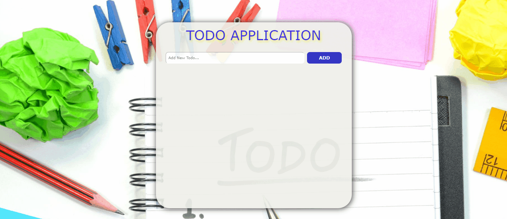

<p>Clarusway</p>

## Project-08 : To-Do App

## GO TO NETLIFY ➡ https://08todoapp.netlify.app/

<p></p>

## Description

Project aims to create a simple To-Do App.

## Problem Statement

- Your company has recently started on a project that aims to create a simple To-Do App. So you and your colleagues have started to work on the project.
- User should create, delete and mark tasks as them done or undone

## Project Skeleton

```

|
|----readme.md         # Given to the students (Definition of the project)
|----solution
        |----index.html
        |----style.css
        |----index.js
```

## Objective

Make a To-Do App as in the sample designs.

### At the end of the project, following topics are to be covered;

- HTML

- CSS

- JS

### At the end of the project, students will be able to;

- improve coding skills within HTML & CSS & JS

- use git commands (push, pull, commit, add etc.) and Github as Version Control System.
